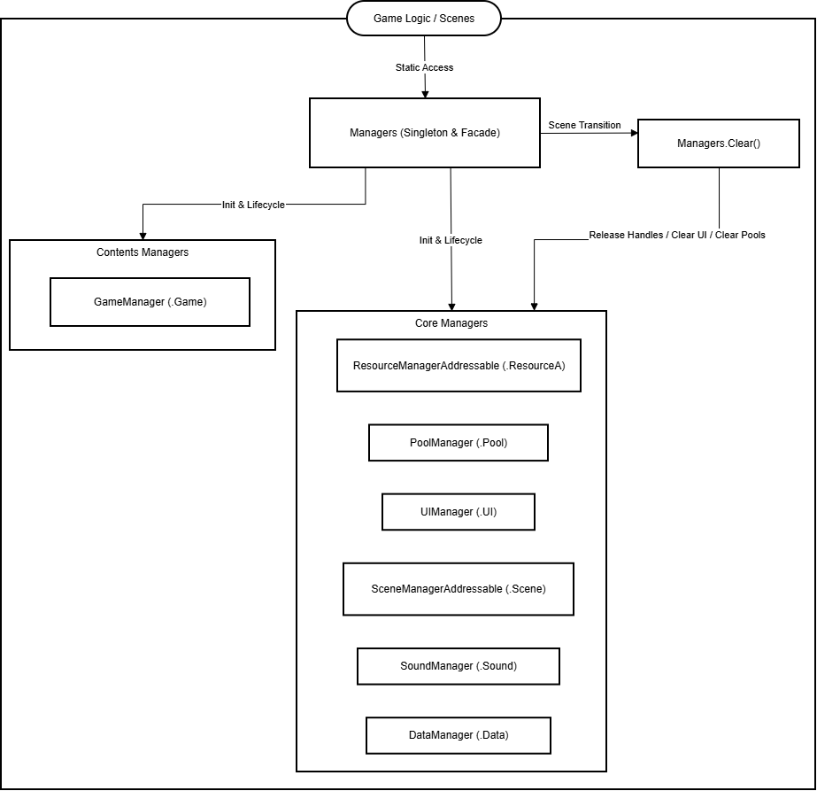
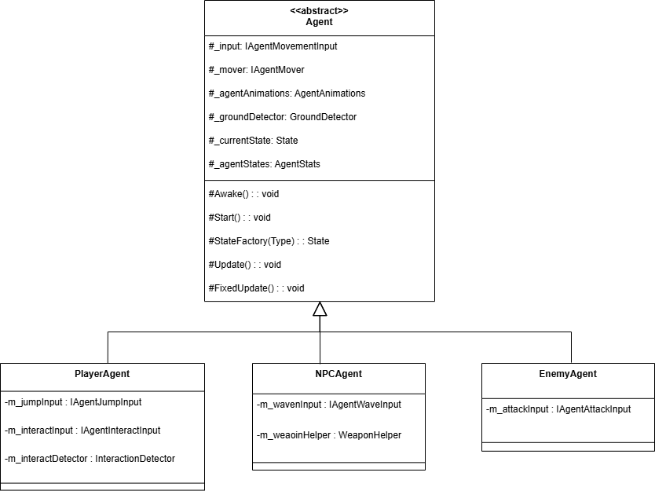
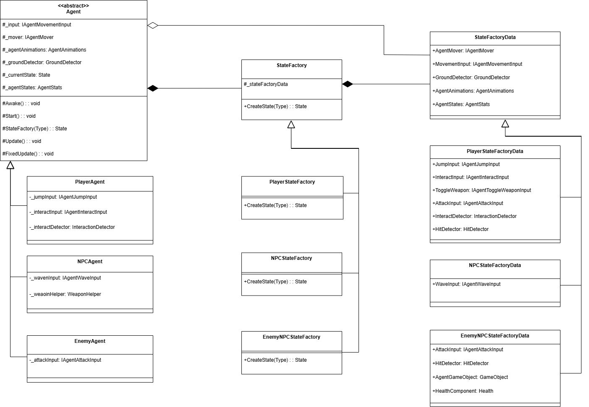
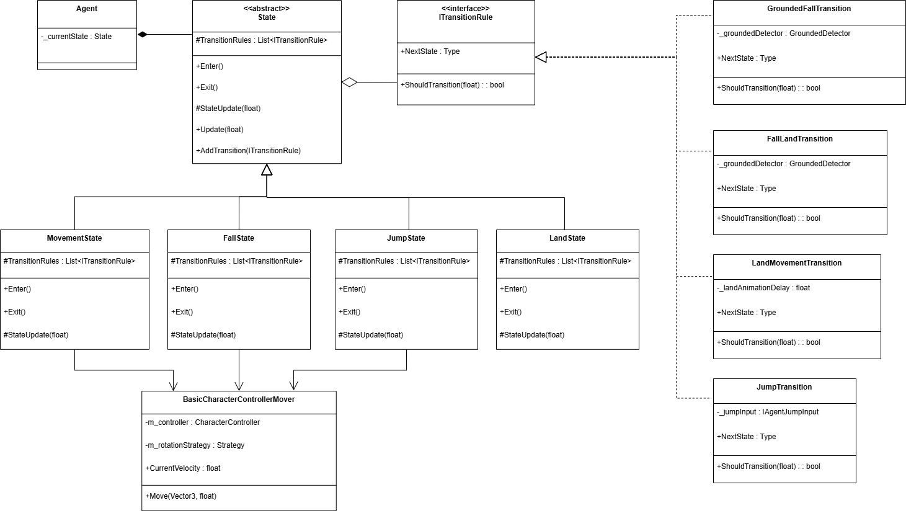
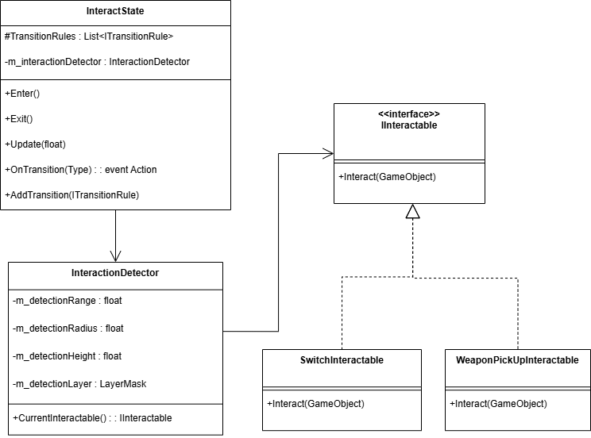
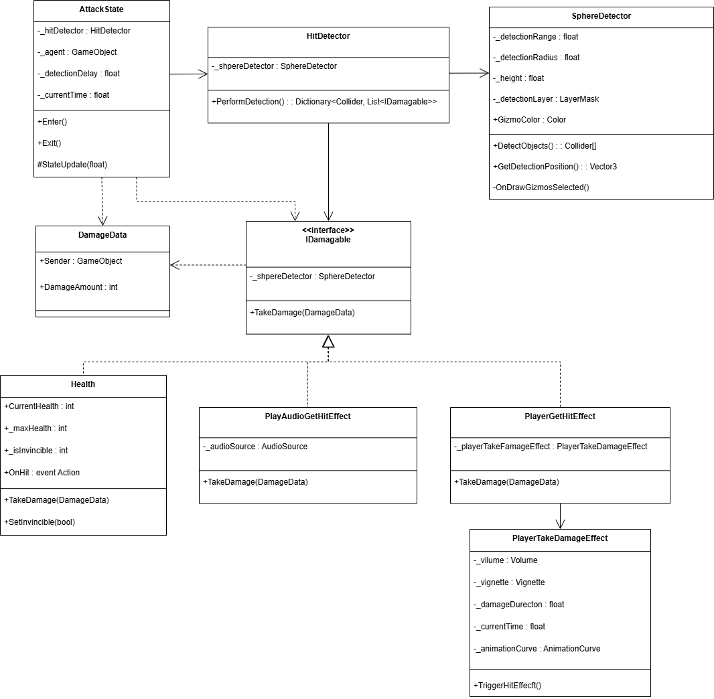
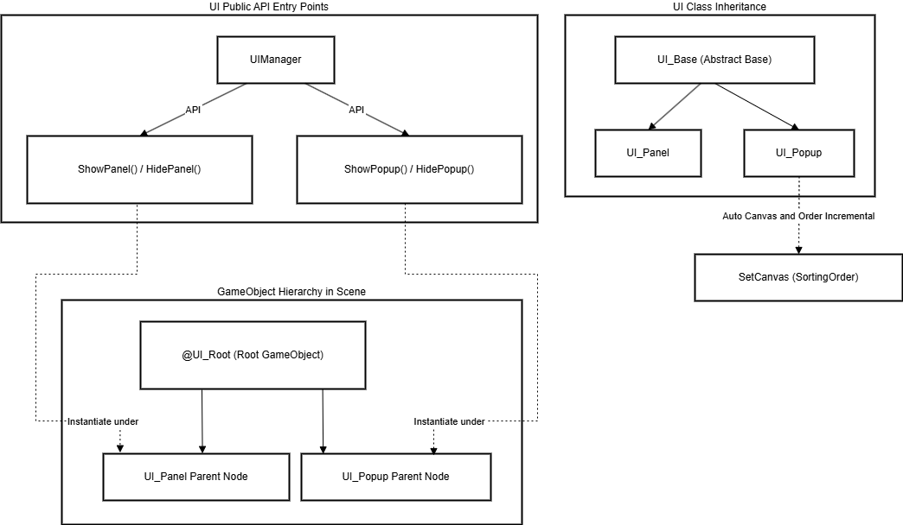

# Unity Framework


## 1. 프로젝트 개요

본 프로젝트는 실무에서 신규 게임이나 프로토타입을 처음부터 개발할 때마다 반복적으로 구현해야 하는 기초 시스템(씬 관리, 비동기 리소스 로딩, UI 구조, 데이터파싱 등)을 미리 모듈화하고 구조화해 둔 **Unity 기반의 개인 게임 프레임워크**입니다.

실제 개발 현장에서는 게임 고유의 재미있는 콘텐츠를 만드는 것보다 매번 기본적인 기반 시스템을 다시 구축하는 데 과도한 시간과 비효율이 발생하곤 합니다. 이러한 문제를 해결하기 위해 자주 쓰이는 핵심 시스템들을 느슨하게 결합된 형태로 미리 구조화하여 필요한 기능을 빠르게 조합해 쓸 수 있는 탄탄한 뼈대를 구성했습니다. 

이 프레임워크를 활용함으로써 신규 프로젝트 진입 시 **초기 개발 속도를 단숨에 높이고, 일정 수준 이상의 일관된 코드 구조와 품질을 지속적으로 유지**할 수 있습니다.

---

## 2. 기술 스택

| 구분 | 기술 / 개념 | 세부 내용 |
| :--- | :--- | :--- |
| **Engine** | Unity 6 | 최신 Unity LTS 버전의 안정성과 신기능 적용 (URP, New Input System 등) |
| **Language & Async** | C#, UniTask | 객체 지향 프로그래밍(OOP) 설계, UniTask를 활용한 Zero-Allocation 비동기 프로그래밍 |
| **Resources** | Addressables | 어드레서블 에셋 시스템을 활용한 메모리 및 에셋 관리 최적화, 비동기 로딩 |
| **UI System** | Canvas, TextMeshPro | 캔버스 정렬 규칙 및 상속 구조를 활용한 화면 최적화 및 확장형 UI 시스템 |
| **Design Pattern** | Singleton, Pool, State, Factory, Strategy, Observer | 핵심 관리 계층 단일화, 상태 패턴 및 팩토리를 통한 상태 생성/주입, 전략 패턴 기반의 행동 캡슐화, 옵저버 패턴을 통한 이벤트 느슨한 결합 |
| **Data Format** | JSON | 데이터 기반 설계를 위한 데이터 파싱 및 파일 연동 |

---

## 3. 핵심 아키텍처 & 시스템 설계 

### 3.1. 중앙 집중식 매니저 구조
*   **클래스**: [Managers.cs](Assets/Scripts/Managers/Managers.cs)
*   **설명**: 씬 전체에서 영속적으로 유지되는 `@Managers` 오브젝트를 중심으로, 하위 시스템(리소스, 풀링, UI, 데이터, 입력 등)에 전역적으로 단일 접근 창구를 제공하는 파사드(Facade) 형태의 싱글톤 아키텍처를 취하고 있습니다.
*   **특징**: 
    *   중구난방으로 존재하는 싱글톤을 배제하여 라이프사이클과 종속성을 한 곳에서 예측 가능하게 관리합니다.
    *   **매니저 간 종속성 문제 해결**: 각 하위 매니저 초기화 시 필요한 객체(`ResourceA`, `Pool` 등)를 `Init()`을 통해 순차 주입(Dependency Injection)하여 매니저 간 얽힘 및 순환 참조를 차단했습니다. 또한 씬 정리 시 종속 역순(`PoolManager`를 최후 정리)으로 해제 순서를 제어하여 교착 상태를 예방합니다.
    *   씬 전환 시 `Clear()` 메서드를 호출하여 구독 관계, 메모리, 풀링 객체 등을 일괄 수거하여 잔존 메모리 누수를 원천 차단합니다.




### 3.2. 인터페이스 기반 Agent & FSM 시스템
*   **클래스 및 인터페이스**: [Agent.cs](Assets/Scripts/Agent/Agent.cs), [StateFactory.cs](Assets/Scripts/Agent/StateFactory/StateFactory.cs), [State.cs](Assets/Scripts/Agent/State/State.cs), [ITransitionRule](Assets/Scripts/Agent/Transitions/ITransitionRule.cs), [IInteractable.cs](Assets/Scripts/Object/Interact/IInteractable.cs), [IDamageable.cs](Assets/Scripts/DamageSystem/IDamageable.cs), [DamageData.cs](Assets/Scripts/DamageSystem/DamageData.cs)
*   **설명**: 에이전트의 이동, 상호작용, 피격 등 핵심 시스템을 추상 클래스와 인터페이스 기반으로 모듈화하여, 플레이어·NPC·적 개체 간의 높은 확장성과 느슨한 결합을 달성한 다형성 아키텍처입니다.
*   **세부 아키텍처 및 구현 내용**:
    1. **Agent 추상 클래스 및 개체 세분화**:
       * 최상위 `Agent` 추상 클래스를 기반으로 `PlayerAgent`, `NPCAgent`, `EnemyAgent`를 파생 구현하였습니다.
       * 각 에이전트의 공통 lifecycle과 핵심 컴포넌트를 통합 관리하며, 주입되는 컨트롤러/입력에 따라 플레이어 제어, NPC AI, 적 AI 동작으로 분기되도록 설계했습니다.
       
       

    2. **StateFactory 패턴을 통한 상태 생성 및 주입**:
       * 에이전트 생성 및 초기화 시 필요한 상태(`State`) 객체를 에이전트가 직접 생성하지 않고 `StateFactory`(`PlayerStateFactory`, `NPCAgentStateFactory`, `EnemyNPCStateFactory`)를 통하게 설계하였습니다.
       * 상태 동적 생성 및 필수 데이터(`StateFactoryData`) 주입을 팩토리 내로 캡슐화함으로써 인스턴스화 책임과 에이전트 로직을 깔끔하게 분리하고 OCP(개방-폐쇄 원칙)를 준수했습니다.
       
       

    3. **FSM 기반 MovementSystem (State & ITransitionRule)**:
       * `State` 추상 클래스와 `ITransitionRule` 인터페이스를 결합하여 상태 기반 이동 조작(`MovementSystem`)을 구축했습니다.
       * 상태 자체의 실행 로직과 상태 전환 규칙을 상호 분리하여, 새로운 이동 상태나 전이 조건 추가 시 기존 코드를 수정하지 않고 유연하게 확장할 수 있습니다.
       
       

    4. **IInteractable 기반 InteractionSystem**:
       * 상호작용 가능한 모든 오브젝트 및 NPC에 `IInteractable` 인터페이스를 적용하고, 이를 중앙에서 탐지/실행하는 `InteractionSystem`을 구축했습니다.
       * 에이전트는 상호작용 대상의 구체적인 타입(상점, 대화 NPC, 아이템 등)을 알 필요 없이 통일된 인터페이스 계약을 통해 유연하게 연동됩니다.
       
       

    5. **IDamageable & DamageData 기반 DamageableSystem**:
       * `IDamageable` 인터페이스를 활용해 피격 가능한 개체(플레이어, 몬스터, 파괴 가능 오브젝트 등)를 통합 관리하는 `DamageableSystem`을 구현했습니다.
       * 피격 전달 시 단순 float 수치가 아닌 `DamageData` 객체를 전달하도록 설계하여, 데미지 양, 타격 유형(물리/마법), 크리티컬 여부, 노크백 데이터 등을 추후에 손쉽게 확장/수정할 수 있도록 가용성을 확보했습니다.
       
       


### 3.3. 비동기 에셋 & 씬 관리
*   **클래스**: [ResourceManagerAddressable.cs](Assets/Scripts/Managers/Core/ResourceManagerAddressable.cs), [SceneManagerAddressable.cs](Assets/Scripts/Managers/Core/SceneManagerAddressable.cs)
*   **설명**: 어드레서블 에셋 시스템을 래핑하여 에셋의 비동기 로딩 및 인스턴스화, 해제를 효율적으로 처리합니다.
*   **특징**:
    *   동일 에셋 중복 로드 방지를 위한 내부 캐싱 시스템(`Dictionary<string, AsyncOperationHandle>`) 구축.
    *   씬을 전환할 때 어드레서블 씬 비동기 로딩을 거쳐 대규모 리소스도 프레임 드랍 없이 자연스럽게 전환할 수 있는 구조를 제공합니다.

### 3.4. 오브젝트 풀링
*   **클래스**: [PoolManager.cs](Assets/Scripts/Managers/Core/PoolManager.cs), [Poolable.cs](Assets/Scripts/Managers/Core/Poolable.cs)
*   **설명**: 몬스터, 이펙트, 투사체 등 자주 스폰/디스폰되는 게임 오브젝트의 생성/파괴(Instantiate/Destroy) 런타임 비용 및 가비지 컬렉션(GC) 스파이크를 줄이기 위한 풀링 시스템입니다.
*   **특징**:
    *   `ResourceManagerAddressable.Destroy()` 시에 오브젝트에 `Poolable` 컴포넌트 존재 여부를 검사하여, 자동 풀링 또는 어드레서블 릴리즈 처리를 단일 인터페이스로 분기 처리하여 개발 편의성을 높였습니다.

### 3.5. UI 프레임워크 
*   **클래스 및 인터페이스**: [UIManager.cs](Assets/Scripts/Managers/Core/UIManager.cs), [UI_Base.cs](Assets/Scripts/UI/UI_Base.cs), [UI_Panel.cs](Assets/Scripts/UI/Panel/UI_Panel.cs), [UI_Popup.cs](Assets/Scripts/UI/Popup/UI_Popup.cs), [UI_EventHandler.cs](Assets/Scripts/UI/UI_EventHandler.cs)
*   **설명**: 화면 전체를 덮는 Panel UI, 스택 기반의 Popup UI, 탭/아이템 단위의 Sub-Item UI를 계층적으로 구분하여 관리하는 시스템입니다.
*   **특징**:
    *   **계층화된 GameObject 구조 분리**: `@UI_Root` 하위에 `UI_Panel` 및 `UI_Popup` 전용 부모 게임오브젝트 노드를 각각 배치하여 Hierarchy 뷰를 명확히 분리·관리합니다.
    *   **통합 API 및 자료구조 분리 관리**: 외부 진입점으로 `ShowPanel()` / `ShowPopup()` 메서드를 제공하며, `UI_Panel`은 `Dictionary<string, UI_Panel>`로 효율적인 로드 및 관리를 수행하고 `UI_Popup`은 `Stack<UI_Popup>`으로 관리합니다.
    *   **정렬 순서(Sorting Order) 동적 관리**: Canvas의 `overrideSorting` 및 Order 값을 팝업 스택 기반으로 자동 부여하여 중첩 시 드로우콜 순서를 제어합니다.
    *   **자동 바인딩 시스템**: `UI_Base`에 구현된 `Bind<T>()`와 `Get<T>()`를 통해 `GetComponent`나 인스펙터 드래그 앤 드롭 없이 코드 상에서 안전하고 빠르게 UI 요소 및 이벤트를 바인딩합니다.

    


### 3.6. 데이터 기반 설계 
*   **클래스**: [DataManager.cs](Assets/Scripts/Managers/Core/DataManager.cs)
*   **설명**: 캐릭터 스탯, 아이템 스펙 등의 기획 데이터를 외부 JSON 포맷으로 저장 및 관리하고, 런타임에 역직렬화하여 캐싱해두는 데이터 로딩 매니저입니다.
*   **특징**:
    *   코드 로직 변경 없이 JSON 파일 수정만으로 게임 내 수치를 동적으로 밸런싱할 수 있는 유연성을 제공합니다.

---


## 4. 핵심 기술적 해결 능력

### 1) 매니저 간 순환 참조 및 초기화 순서 종속성 해결
*   **문제 상황**: 매니저 클래스의 수가 늘어남에 따라 씬 진입 시 매니저 간 초기화 순서가 보장되지 않아 `NullReferenceException`이 발생하거나 순환 참조 꼬임 현상이 일어날 수 있는 위험이 있었습니다.
*   **해결 방안**:
    *   중앙 통제 클래스인 `Managers.cs` 싱글톤 내부 `Init()` 메서드에서 `ResourceA` ➔ `Pool` ➔ `Scene` ➔ `UI` ➔ `Data` ➔ `Sound` 순서로 명시적인 의존성 로딩 순서를 수동 제어하여 릴레이 초기화를 강제했습니다.
    *   씬 전환 발생 시 `Managers.Clear()`를 호출하여 UI 팝업 Stack, 오브젝트 풀, 어드레서블 로딩 핸들을 역순으로 안전하게 정리하는 메커니즘을 일원화했습니다.
*   **성과 & 가치**: 런타임 매니저 초기화 순서 꼬임 문제를 근본적으로 해결하고, 씬 전환 시 에셋 leak 발생을 완벽하게 차단했습니다.

### 2) 인터페이스 및 StateFactory 기반 Agent 결합도 해소와 확장성 확보
*   **문제 상황**: 플레이어 및 AI/NPC 개체의 이동/입력/상태 로직이 구체 클래스에 직접 결합되면, 새로운 에이전트 상태나 타입을 추가할 때 기존 코드의 대량 수정이 필요하고 테스트 및 확장이 어려운 문제가 있었습니다.
*   **해결 방안**:
    *   `IAgentMover`, `IAgentMovementInput` 등의 추상 인터페이스를 도입하여 입력 소스 및 이동 구현체에 대한 의존성을 역전(DIP)시켰습니다.
    *   `StateFactory` 패턴을 구축하여 에이전트 본체가 상태 생성 책임에서 벗어나도록 분리하고, 전용 팩토리에서 동적으로 상태 인스턴스 및 필수 데이터(`StateFactoryData`)를 주입하도록 구현했습니다.
*   **성과 & 가치**: 동일한 `Agent` 상속 구조 아래에서 PlayerAgent, EnemyAgent, NPCAgent가 컴포넌트 주입만으로 동작하며, 새로운 상태나 전이 규칙 추가 시 기존 코드를 건드리지 않는 완벽한 OCP(개방-폐쇄 원칙)를 달성했습니다.

### 3) 비동기 어드레서블과 오브젝트 풀링의 투명한 결합
*   **문제 상황**: 동기식 로딩(`Resources.Load`) 방식은 대형 에셋 로드 시 메인 스레드가 정지하여 화면 끊김(Stuttering)을 유발하고, 빈번한 오브젝트 생성/파괴(Instantiate/Destroy)는 가비지 컬렉터(GC) 부하를 일으켰습니다.
*   **해결 방안**:
    *   모든 리소스를 Addressable Assets 비동기 로딩 기반으로 파이프라인을 구축하고, 에셋 완료 시 `PoolManager`와 자동 연결되도록 래핑했습니다.
    *   오브젝트 파괴 요청 시 `Poolable` 컴포넌트 유무를 자동으로 탐지하여, 풀링 대상 오브젝트는 `SetActive(false)`로 풀에 회수하고 일반 어드레서블 에셋은 릴리즈 처리하는 투명한(Transparent) 분기 로직을 설계했습니다.
*   **성과 & 가치**: 런타임 프레임 드랍을 최소화하고 GC 부하를 대폭 줄였으며, 개발자가 풀링 여부를 매번 인지하지 않아도 단일 메서드로 안전하게 관리할 수 있게 하였습니다.

### 4) 계층구조 변경에 강건한 UI 컴포넌트 자동 바인딩
*   **문제 상황**: UI 작업 시 인스펙터 드래그 앤 드롭 방식이나 `transform.Find()` 방식은 UI 계층구조(Hierarchy) 변경 시 런타임 널 에러를 유발하고 작업 효율을 저해했습니다.
*   **해결 방안**:
    *   `UI_Base`에 Enum 타입과 자식 오브젝트 명칭을 일치시켜 동적으로 컴포넌트를 자동 탐색·바인딩하는 제네릭 시스템(`Bind<T>()`, `Get<T>()`)을 구축했습니다.
    *   `UI_EventHandler` 컴포넌트를 통해 UI 클릭, 드래그 이벤트를 Action/Delegate로 래핑하여 스크립트 단에서 직접 바인딩하도록 구현했습니다.
*   **성과 & 가치**: UI 인스펙터 의존성을 최소화하여 UI 리디자인이나 계층구조 변경 시에도 코드 수정 없이 안정성을 유지할 수 있도록 구조를 완성했습니다.

---

## 📂 5. 프로젝트 구조

```text
Assets/
├── AddressableAssetsData/    # 어드레서블 에셋 메타데이터 및 그룹 설정
├── Animations/               # 캐릭터 애니메이션 클립 및 애니메이터 컨트롤러
├── Fonts/                    # 폰트 에셋 및 텍스트 스타일 리소스
├── GameData/                 # 외부 기획용 JSON 데이터 파일
├── InputSystem/              # Unity New Input System 액션 맵 설정
├── Material/                 # 머티리얼 및 재질 에셋
├── Models/                   # 3D 모델 및 메쉬 파일
├── Plugins/                  # 외부 확장 플러그인 및 네이티브 라이브러리
├── Prefabs/                  # 게임 오브젝트 템플릿 (UI, 플레이어, 몬스터, 서브아이템 등)
├── Resources/                # 동기식 로딩 대응 및 임시 기틀 에셋
├── Scenes/                   # 게임 내 씬 파일 (Dev, Game 등)
├── Shaders/                  # 커스텀 셰이더 및 Shader Graph 파일
├── Sounds/                   # BGM 및 SFX 오디오 클립
├── TextMesh Pro/             # TMP 폰트 에셋 및 그래픽 리소스
├── Textures/                 # UI 및 월드 오브젝트용 텍스처/스프라이트
├── URP/                      # Universal Render Pipeline 설정 및 에셋
├── VFX/                      # 이펙트 및 파티클 시스템 에셋
└── Scripts/                  # 핵심 프로그래밍 스크립트 모듈
    ├── Agent/                # 플레이어, Enemy, NPC 에이전트 계층 및 상태 제어
    │   ├── Player/           # PlayerAgent, PlayerGameInput, PlayerMover
    │   ├── Enemy/            # EnemyAgent 및 AI 상태
    │   └── NPC/              # NPCAgent 및 상호작용
    ├── Contents/             # 캐릭터 스탯, 스킬 및 게임플레이 로직
    ├── DamageSystem/         # IDamageable, DamageData 기반 데미지/피격 모듈
    ├── Data/                 # JSON 데이터 역직렬화 C# 데이터 구조
    ├── Detector/             # GroundedDetector, 시야/범위 감지기 컴포넌트
    ├── Editor/               # 에디터 확장 및 인스펙터 커스텀 스크립트
    ├── Managers/             # 싱글톤 메인 매니저 및 서브 매니저 그룹
    │   ├── Core/             # Resource, Pool, UI, Scene, Sound, Data 매니저
    │   └── Contents/         # GameManager 등 게임 전역 콘텐츠 매니저
    ├── Object/               # 일반 월드 오브젝트 제어 클래스
    ├── Scenes/               # BaseScene 기반 씬 초기화 및 생명주기 제어
    ├── UI/                   # UI 프레임워크 핵심 구조
    │   ├── Panel/            # UI_Panel 베이스 및 상점/인벤토리 패널
    │   ├── Popup/            # UI_Popup 베이스 및 버튼/알림 팝업
    │   └── SubItem/          # 인벤토리 슬롯 등 재사용 가능 서브아이템
    └── Utils/                # Define, Extension, 유틸리티 함수 모음
```

---

## 6. 코드 스타일


**[Coding Conventions 문서 상세 보기](./Doc/Coding_Conventions.md)**
